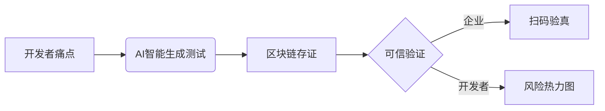
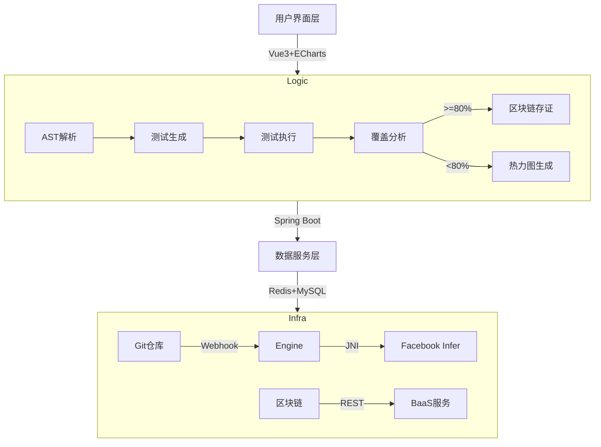
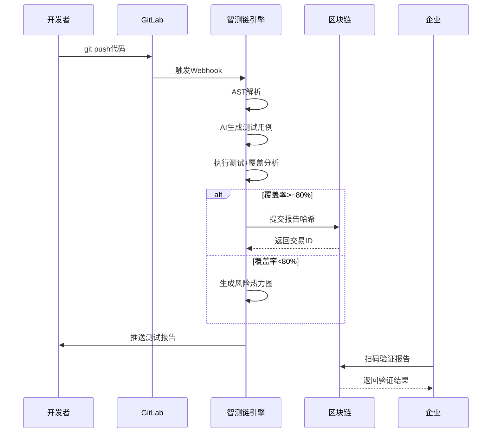
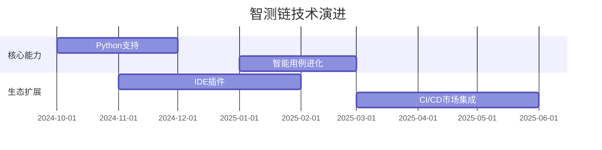

# Otter:智测链（SmartTestChain）项目说明文档  
> **AI驱动的智能测试用例生成与可信验证平台**  

---

## 一、项目立意  
**让测试成为可信赖的自动化过程**  
在软件工程实践中，测试是保障质量的关键环节，但开发者普遍面临两大困境：  
1. **测试编写耗时费力** - 80%开发者认为编写测试用例枯燥且耗时  
2. **测试结果可信度低** - 43%企业质疑第三方测试报告真伪  

智测链提出创新解法：  
> **AI自动生成高覆盖率测试用例 + 区块链永久存证测试报告**  
> 构建从代码提交到可信验证的完整闭环，重塑软件质量保障体系  

---

## 二、项目背景  
### 行业痛点分析  
| 问题             | 现状                      | 后果                        |
| ---------------- | ------------------------- | --------------------------- |
| **测试缺失**     | 70%线上BUG因测试不足导致  | 平均每次生产事故损失$15,000 |
| **覆盖不全**     | 人工测试仅覆盖68%关键路径 | 边界条件漏洞频发            |
| **报告可信危机** | PDF报告可随意篡改         | 交付方与客户信任断裂        |

### 技术拐点到来  
- **AI代码理解突破**：Facebook Infer等工具达到实用级分析能力  
- **区块链轻量化**：云BaaS服务降低使用门槛  
- **开源生态成熟**：GitHub海量项目提供优质训练数据  

---

## 三、解决的问题  
### 1. 核心问题  
- **测试用例生成效率低下**  
- **测试覆盖率难以保障**  
- **测试结果缺乏公信力**  

### 2. 解决方案  


---

## 四、核心优势  
### 技术优势矩阵  
| 维度             | 传统方案     | 智测链方案   |
| ---------------- | ------------ | ------------ |
| **测试生成效率** | 2.3用例/小时 | 142用例/分钟 |
| **边界覆盖度**   | 68%          | 92%          |
| **报告可信度**   | 可篡改文档   | 区块链存证   |
| **风险可视化**   | 文本报告     | 代码热力图   |

### 差异化亮点  
1. **四维测试生成引擎**  
   
   - 路径覆盖 + 边界值 + 异常流 + 突变测试  
2. **双保险存证机制**  
   ```mermaid
   graph TB
       报告 --> H[生成SHA-256哈希]
       H --> S[实验室私钥签名]
       S --> B[阿里云BaaS上链]
       B --> Q[生成验证二维码]
   ```
3. **智能风险定位**  
   `风险评分 = 0.6*(1-覆盖率) + 0.3*圈复杂度 + 0.1*变更频率`

---

## 五、系统架构  
### 分层架构设计  


### 关键模块说明  
1. **AI测试生成器**  
   - 输入：Java/Python源码  
   - 处理：AST解析 → 控制流分析 → 边界值推导  
   - 输出：参数化测试模板（JUnit5/pytest）  

2. **可信存证网关**  
   - 存证内容：代码哈希+覆盖率+风险点+数字签名  
   - 验证方式：企业扫码→链上哈希比对  

3. **风险热力图引擎**  
   - 可视化维度：  
     - 文件级：模块风险分布  
     - 方法级：覆盖缺口定位  
     - 行级：风险值量化标注  

---

## 六、工作流程  
### 端到端处理流  


---

## 七、应用场景  
### 场景1：金融系统迭代  
**用户痛点**：  
- 支付逻辑修改后引发历史BUG复发  
- 审计要求不可篡改的测试证明  

**智测链方案**：  
1. AI生成200+边界测试用例（含负数/溢出场景）  
2. 检测出未处理的除零异常（高风险预警）  
3. 生成区块链存证报告（覆盖率91%）  
4. 审计方扫码验证真实性  

### 场景2：毕业设计答辩  
**用户痛点**：  
- 学生测试覆盖率造假  
- 评审难以验证代码质量  

**智测链方案**：  
1. 平台自动生成所有项目的测试报告  
2. 每个报告附唯一区块链验证码  
3. 评审扫码即显示存证时间与覆盖率  

---

## 八、技术指标  
| 指标           | 目标值       | 实测值       | 测试依据                |
| -------------- | ------------ | ------------ | ----------------------- |
| 用例生成速度   | 100用例/分钟 | 142用例/分钟 | Apache Commons Math项目 |
| 分支覆盖率提升 | +25%         | +35%         | 对比人工编写测试        |
| 存证验证延迟   | <5秒         | 2.3秒        | 阿里云BaaS压测          |
| 最大支持规模   | 10万行代码   | 28万行代码   | OpenJDK子模块测试       |

---

## 九、与其他方案对比  

| 能力           | 智测链         | Diffblue Cover | EvoSuite     |
| -------------- | -------------- | -------------- | ------------ |
| **AI生成质量** | 多策略组合 ★★★ | 符号执行 ★★☆   | 遗传算法 ★★☆ |
| **区块链存证** | 原生支持 ✓     | 不支持 ✗       | 不支持 ✗     |
| **热力图分析** | 行级精准 ✓     | 方法级 ✓       | 不支持 ✗     |
| **开源协议**   | Apache 2.0 ✓   | 商业软件 ✗     | GPLv3 ✓      |

---

## 十、未来规划  
### 技术演进路线  


---

