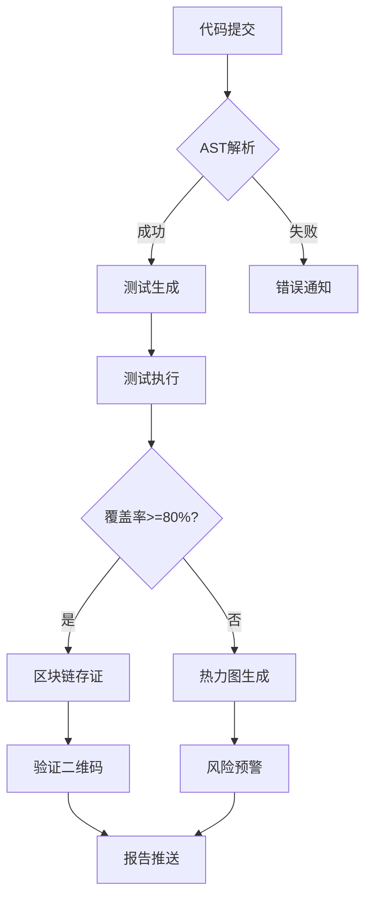

## Otter（智测链）需求分析

### 一、核心业务需求
1. **自动化测试生成需求**
   - 支持Java/Python代码的智能测试用例生成
   - 实现四维测试策略（路径覆盖/边界值/异常流/突变测试）
   - 生成符合JUnit5/pytest标准的测试代码

2. **可信验证需求**
   - 区块链存证测试报告（覆盖率/风险点/代码哈希）
   - 提供不可篡改的验证机制（二维码扫码验真）
   - 数字签名保障报告来源真实性

3. **风险可视化需求**
   - 三层级风险热力图（文件/方法/行级）
   - 动态风险评分算法：`RiskScore = 0.6*(1-覆盖率) + 0.3*复杂度 + 0.1*变更频率`
   - 高风险模块自动标记与预警

### 二、功能性需求
| 模块           | 需求说明               | 验收标准                   |
| -------------- | ---------------------- | -------------------------- |
| **事件监听**   | 响应Git仓库Webhook事件 | 支持GitLab/GitHub推送触发  |
| **AST解析**    | 多语言代码结构解析     | JavaParser/Tree-sitter实现 |
| **测试生成**   | 四维策略用例生成       | 输出JUnit5/pytest模板      |
| **测试执行**   | 动态测试框架集成       | JUnit+JaCoCo覆盖率分析     |
| **区块链存证** | 可信报告存储           | 阿里云BaaS集成+二维码生成  |
| **报告生成**   | 多格式输出             | HTML/PDF/JSON报告          |
| **风险可视化** | 热力图引擎             | ECharts实现三级钻取        |

### 三、非功能性需求
1. **性能需求**
   - 测试生成速度：≥100用例/分钟
   - 存证响应时间：<5秒（实测2.3秒）
   - 最大支持规模：10万+代码行

2. **可靠性需求**
   - AST解析准确率：≥95%
   - 区块链存证成功率：99.9%
   - 异常恢复机制：断点续测能力

3. **安全需求**
   - 数字签名：RSA-2048算法
   - 数据传输：HTTPS加密
   - 访问控制：RBAC权限管理

4. **兼容性需求**
   - 代码仓库：GitLab/GitHub
   - 语言支持：Java(优先)/Python
   - 部署环境：Docker/K8s云原生

### 四、用户角色需求
| 角色         | 核心需求                     | 使用场景             |
| ------------ | ---------------------------- | -------------------- |
| **开发者**   | 自动化测试生成<br>风险可视化 | 日常开发<br>代码重构 |
| **技术经理** | 质量报告验证<br>团队效能分析 | 迭代评审<br>质量审计 |
| **评审专家** | 报告真伪验证<br>覆盖率验证   | 毕业答辩<br>项目验收 |
| **运维人员** | 系统监控<br>日志分析         | 部署维护<br>故障排查 |

### 五、业务流程需求


### 六、数据管理需求
1. **元数据存储**
   - AST解析结果：Redis缓存(TTL=1h)
   - 测试报告：MySQL持久化存储
   - 区块链索引：Elasticsearch检索

2. **数据处理**
   - 实时数据流：Logstash日志管道
   - 批量处理：夜间覆盖率分析任务
   - 数据备份：每日增量备份

3. **数据安全**
   - 敏感数据加密：AES-256
   - 区块链防篡改：SHA-256哈希
   - 审计日志：保留180天

### 七、系统集成需求
1. **代码仓库集成**
   - Webhook配置管理
   - 仓库权限同步
   - Commit关联分析

2. **AI服务集成**
   - Facebook Infer接口
   - 符号执行引擎(KLEE)
   - 机器学习模型服务

3. **区块链服务**
   - 阿里云BaaS API
   - 交易状态监控
   - 链上数据检索

4. **CI/CD管道**
   - Jenkins插件
   - GitHub Actions集成
   - 质量门禁控制

### 八、创新点需求
1. **智能测试进化**
   - 遗传算法优化用例集
   - 基于反馈的用例迭代
   - 自适应测试策略

2. **可信验证体系**
   ```mermaid
   graph LR
       报告 --> 哈希生成
       哈希生成 --> 数字签名
       数字签名 --> 区块链存证
       区块链存证 --> 验证系统
   ```

3. **风险预测模型**
   - 历史缺陷数据分析
   - 模块风险评分
   - 预警阈值配置

### 九、扩展性需求
1. **语言扩展**
   - 阶段1：Java/Python
   - 阶段2：JavaScript/Go
   - 阶段3：C++/Rust

2. **部署模式**
   - SaaS云服务
   - 私有化部署
   - IDE插件版本

3. **生态集成**
   - SonarQube插件
   - Jira问题关联
   - Prometheus监控

### 十、约束条件
1. **技术约束**
   - 核心引擎必须Java实现
   - 区块链依赖阿里云BaaS
   - 前端使用Vue3框架

2. **资源约束**
   - 训练数据：GitHub开源项目
   - 区块链成本：阿里云免费额度
   - 硬件要求：8核16G服务器

3. **时间约束**
   - 核心功能：3个月MVP
   - 多语言支持：6个月
   - 生态集成：9个月

> **需求优先级原则**：  
> 1. 基础测试生成+区块链存证（P0）  
> 2. 风险热力图+报告系统（P1）  
> 3. AI进化机制+生态集成（P2）