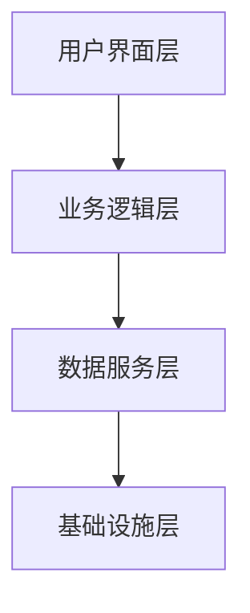
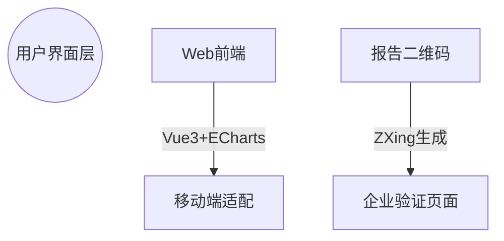
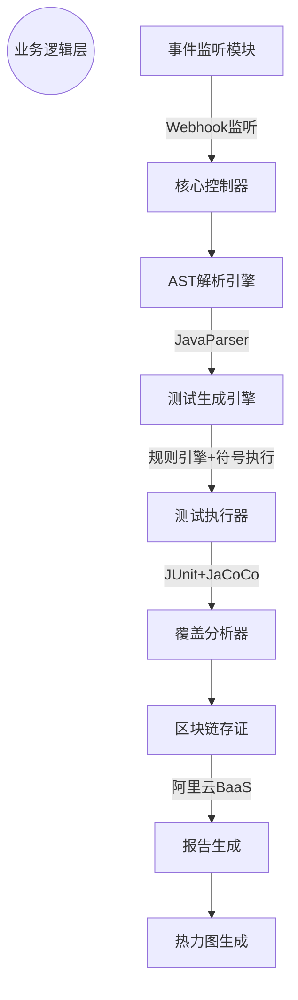
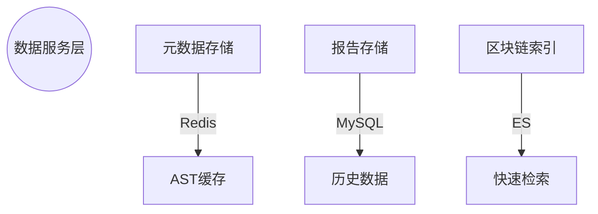
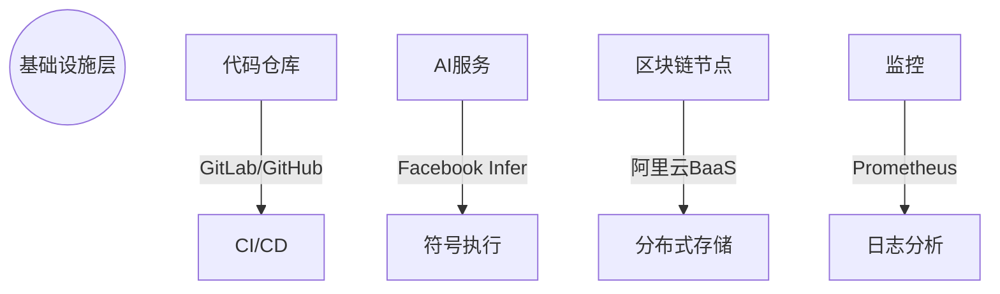
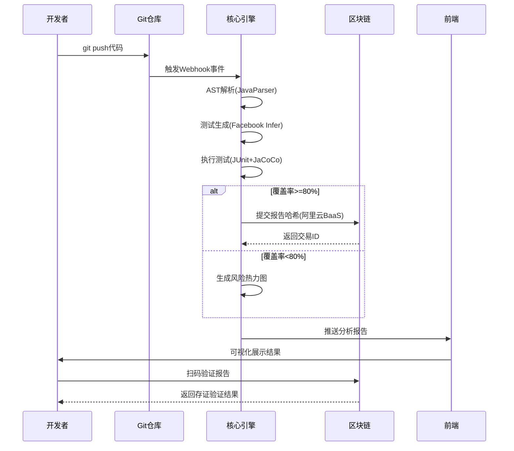
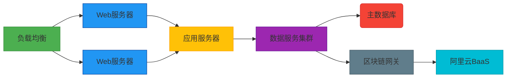

### Otter 系统框架图



---

#### 1. **用户界面层**  

- **Web前端**：Vue3 + ECharts实现动态看板  
  - 测试覆盖率热力图（文件/方法/行三级钻取）  
  - 区块链存证验证面板（扫码即验真伪）  
- **移动端适配**：响应式设计支持手机查看报告  
- **二维码系统**：基于ZXing生成区块链存证验证码  



#### 2. **业务逻辑层（Java实现核心）**  

|      模块      |                           实现方案                           |            关键技术             |
| :------------: | :----------------------------------------------------------: | :-----------------------------: |
|  **事件监听**  |                        Webhook分发器                         |    Spring Webflux响应式编程     |
|  **AST解析**   |                        代码元数据提取                        |      JavaParser构建语法树       |
|  **测试生成**  | 四维用例生成策略：<br>1. 路径覆盖<br>2. 边界值<br>3. 异常流<br>4. 突变测试 | 规则引擎(Drools)+符号执行(KLEE) |
|  **测试执行**  |                         动态测试框架                         |    JUnit5 + Maven嵌入式调用     |
|  **覆盖分析**  |                         风险智能标记                         | JaCoCo字节码插桩 + 风险权重算法 |
| **区块链存证** |                          轻量级上链                          |      阿里云BaaS REST客户端      |
|  **报告生成**  |                          多格式输出                          |      PDF/HTML/JSON模板引擎      |



#### 3. **数据服务层**  

- **AST缓存**：Redis存储语法树解析结果（TTL=1h）  
- **报告存储**：MySQL关系型存储（测试报告核心指标）  
- **区块链索引**：Elasticsearch实现秒级存证查询  
- **数据管道**：Logstash实现分析日志实时抽取  



#### 4. **基础设施层**  

|     组件     |     作用     |            选型理由            |
| :----------: | :----------: | :----------------------------: |
| **代码仓库** |    触发源    |     GitLab CE（开源可控）      |
|  **AI服务**  | 增强测试生成 | Facebook Infer（Java原生支持） |
|  **区块链**  |   可信存证   |      阿里云BaaS（免运维）      |
|  **CI/CD**   | 自动化流水线 |   GitHub Actions（免费额度）   |
|   **监控**   |  系统健康度  |   Prometheus+Grafana监控堆栈   |



### 关键数据流说明  


---

### 创新点实现路径  
1. **智能测试生成**  
   ```mermaid
   graph LR
       S[源代码] --> A[AST解析]
       A --> B[控制流图生成]
       B --> C[路径分析]
       C --> D[边界值推导]
       D --> E[异常注入点]
       E --> F[组合测试用例]
   ```
   - **路径分析**：基于McCabe圈复杂度算法  
   - **边界值推导**：参数类型驱动的值域分析  

2. **区块链存证机制**  
   ```mermaid
   graph TB
       WW[报告] --> H[生成SHA-256哈希]
       H --> S[签名实验室私钥]
       S --> C[调用BaaS API]
       C --> T[获取区块链交易ID]
       T --> Q[生成验证二维码]
   ```
   - 抗篡改设计：哈希值+数字签名双重保护  

3. **风险热力图算法**  
   
   $\boxed{\text{RiskScore} = \alpha \cdot (1 - \text{Coverage}) + \beta \cdot \text{Complexity} + \gamma \cdot \text{ChangeFrequency}}$
   
   - 权重系数：α=0.6, β=0.3, γ=0.1  
   - 复杂度计算：Cyclomatic + Halstead指标  

---

### 部署拓扑  

